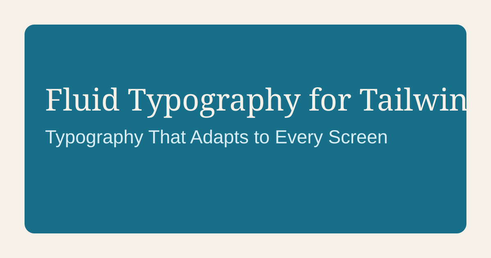

# Fluid Typography for Tailwind CSS v4



A production-ready fluid typography system for Tailwind CSS v4.

Use semantic utility classes powered by CSS `clamp()` and `@theme` variables to scale typography smoothly from mobile to large desktop without breakpoint-heavy text sizing.

## Why this system

- Smooth type scaling across viewport ranges
- Semantic class names (`.text-h1`, `.text-body`, `.text-caption`)
- Flexible styling (apply heading styles to any element)
- One central configuration with six core variables
- Works in Astro, React, Vue, Next.js, and plain HTML

## Core configuration

```css
@theme {
  --fluid-min-width: 360;
  --fluid-max-width: 1280;
  --fluid-min-base: 16;
  --fluid-max-base: 18;
  --fluid-min-ratio: 1.2;
  --fluid-max-ratio: 1.25;
}
```

## Available semantic classes

- Display: `.text-display-xl`, `.text-display-lg`, `.text-display`
- Headings: `.text-h1` to `.text-h6`
- Body: `.text-body-xl`, `.text-body-lg`, `.text-body`, `.text-body-sm`
- Utility: `.text-caption`, `.text-overline`

## Installation

1. Copy `src/styles/advanced-fluid-typography.css` into your project.
2. Import it after Tailwind in your global stylesheet.

```css
@import "tailwindcss";
@import "./advanced-fluid-typography.css";
```

3. Use semantic classes in your UI:

```html
<h1 class="text-h1">Page title</h1>
<p class="text-body">Readable body copy across devices.</p>
<p class="text-caption">Small supporting label</p>
```

## Migration example

```html
<!-- Before -->
<h1 class="text-3xl md:text-5xl lg:text-6xl">Heading</h1>

<!-- After -->
<h1 class="text-h1">Heading</h1>
```

## In this repository

- Core system file: `src/styles/advanced-fluid-typography.css`
- Downloadable CSS: `public/advanced-fluid-typography.css`
- Astro demo/docs site showing interactive usage and configuration

## License

MIT
